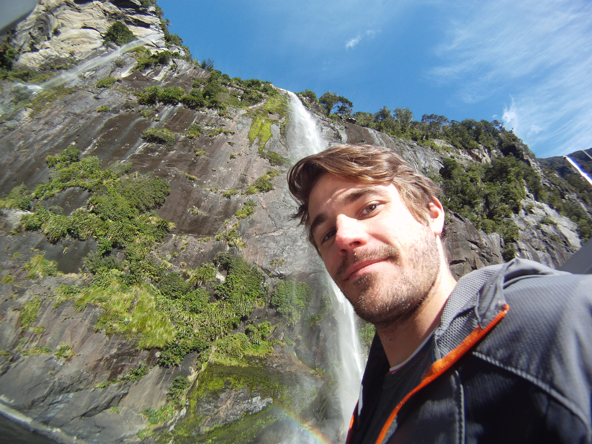

# Chris Brammer

#### I'm an exercise physiologist with a unique background in data science who hopes to enlighten and inform those with a vested interest in health, physical fitness, and sport.

Hi, I'm Chris. I originally developed this website as a platform to expunge, organize, and record my work related to swimming data science before it was lost to history. 

Teacher \\( \cdot \\) Scholar \\( \cdot \\) Gardener \\( \cdot \\) Outdoor adventurer

Born and raised in Nebraska, partial to southern Indiana, enchanted by North Carolina, and currently exploring the redwoods of northern California. Alumnus of Truman State University and Indiana University.

Intrigued by human performance, other cultures, classical music, multimedia art, armchair philosophy, great food, and even better conversations.

Seeking to be inspired, to inspire others, and to live on the edge between the past and the future, where life is happening.

<a class="graybutton" href="/about/Brammer/Brammer_CV.pdf" target="_blank">curriculum vitae</a> 

<!-- Data scientist (health, fitness, & sport domains) • Consulted swimming stakeholders on biased Rio Olympics • PhD Human Performance • Former NCAA athlete & coach -->
