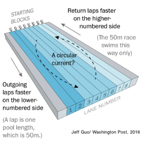
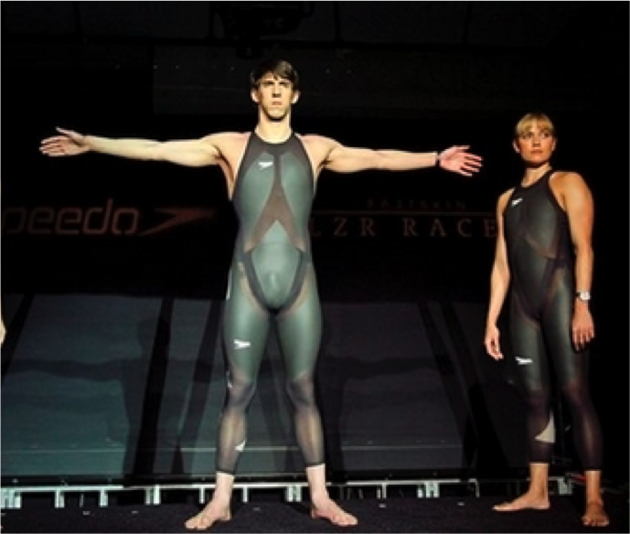

# Publications and Presentations

#### Specifics regarding data processing and analyses from some of our peer-reviewed manuscripts, conference proceedings and presentations.

## Lane bias in elite-level swimming competition

Anecdotal reports by participants at the 2013  World Swimming Championship suggested currents were present in the pool such that, when swimming toward the finishing end, swimmers were at a competitive disadvantage on one side of the pool and at an advantage on the opposite side. Does the data confirm this rumor?

<a class="graybutton" href="/research/lanebias/">Learn more</a>

## Swimsuit bias at the 2008 Olympic Games

We describe a model that allows those that govern  competitive swimming to identify whether or not elite-level competitions were biased due to some external factor. In particular, we test the hypothesis that the swimsuits released to the competitive swimming market in 2008 significantly improved the 2008 Olympic performances. 

<a class="graybutton" href="/research/suitbias">Learn more</a>

